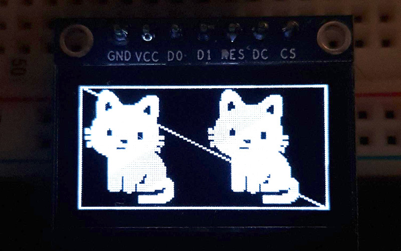

# OLED

OLED is a library to manage the monochrome OLED screen based on chip SSD1306 using SPI comunication.



## Features

Graphic primitives
- [x] Points
- [x] Lines
- [x] Rects
- [ ] Circles
- [ ] Polygons
- [ ] Filled Rects
- [ ] Filled Circles
- [ ] Filled Polygons

Other elements
- [x] Binarized images (JPEG, PNG)


## Setup

*1. edit your mix.exs*

```elixir
def deps do
  [
    {:oled, "~> 0.1.0"}
  ]
end
```

*2. create a display module*

```elixir
defmodule OledApp.MyDisplay do
  use OLED.Display, app: :oled_app

end
```

*3. add the configuration*

```elixir
config :oled_app, OledApp.MyDisplay,
  device: "spidev0.0",
  driver: :ssd1306,
  width: 128,
  height: 64,
  rst_pin: 25,
  dc_pin: 24
```

*4. add your application's supervision tree*
```elixir
defmodule OledApp.Application do
  use Application

  def start(_type, _args) do
    import Supervisor.Spec, warn: false

    children = [
      # Add this line
      OledApp.MyDisplay
    ]

    opts = [strategy: :one_for_one, name: OledApp.Supervisor]
    Supervisor.start_link(children, opts)
  end
end
```

*5. use it*

```elixir
  # Draw something
  OledApp.MyDisplay.rect(0, 0, 127, 63)
  OledApp.MyDisplay.line(0, 0, 127, 63)
  OledApp.MyDisplay.line(0, 63, 127, 0)

  # Display it!
  OledApp.MyDisplay.display()
```
